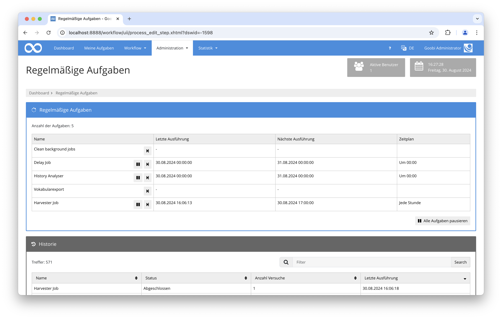

## Einführung
Die vorliegende Dokumentation beschreibt die Installation, die Konfiguration und den Einsatz des Plugins für die automatische, regelmäßige Aktualisierung des HERIS Vokabulars.

## Installation
Voraussetzung ist die Goobi Version 23.03 oder neuer, zusätzlich müssen die folgenden beiden Dateien installiert sein:

```bash
/opt/digiverso/goobi/config/plugin_intranda_quartz_heris.xml
/opt/digiverso/goobi/lib/plugin_intranda_quartz_heris.jar
```

Nach der Installation steht die Funktionalität des Plugins innerhalb der REST-API von Goobi workflow zur Verfügung.

## Überblick und Funktionsweise
Der Import findet regelmäßig zu den in der Datei `goobi_config.properties` festgelegten Zeiten statt. Alternativ kann der Import auch jederzeit von Hand gestartet werden, hierzu kann man als Administrator den Bereich `Regelmäßige Aufgaben` öffnen und den `HERIS Import` einmal ausführen.



Wenn das Plugin ausgeführt wird, verbindet es sich mit dem SFTP-Server und sucht dort nach einer JSON-Datei. Wenn mehrere Dateien existieren, wird die Datei mit dem neuesten Zeitstempel genutzt. Die Datei wird herunter geladen, geöffnet und das JSON-Array in einzelne Objekte geteilt. Pro Objekt wird nun der Identifier gesucht und mit den existierenden Datensätzen verglichen. Wenn der Identifier bereits in einem Datensatz existiert, wird der Datensatz aktualisiert, ansonsten wird ein neuer Datensatz erstellt.

Anschließend werden die konfigurierten Felder durchlaufen und die einzelnen Werte importiert.

Am Ende wird die heruntergeladene Datei wieder vom Goobi-System gelöscht. Auf dem SFTP-System werden keine Daten geändert.

## Konfiguration
Die Konfiguration des Plugins erfolgt in der Datei `plugin_intranda_quartz_heris.xml` wie hier aufgezeigt:

{{CONFIG_CONTENT}}

Die folgende Tabelle enthält eine Zusammenstellung der Parameter und ihrer Beschreibungen:

Parameter               | Erläuterung
------------------------|------------------------------------
`<username>`            | Der Benutzername für den SFTP-Zugang.
`<password>`            | Das Passwort für den SFTP-Zugang.
`<hostname>`            | Der Hostname des SFTP-Servers.
`known_hosts`           | Datei mit dem Fingerabdruck des Servers, erforderlich für die Authentifizierung.
`sftpFolder`            | Pfad zur JSON-Datei auf dem SFTP-Server (bei Speicherung im Home-Verzeichnis: `.` angeben).
`<herisFolder>`         | Lokaler Ordner, in den die JSON-Datei heruntergeladen wird.
`<vocabulary>`          | Name des Vokabulars, das aktualisiert werden soll.
`fieldName`             | Name des Feldes im Vokabular, das überschrieben werden soll.
`jsonPath`              | JSONPath-Ausdruck für das zu extrahierende Feld aus der JSON-Datei.
`identifier`            | Kennzeichnung des Feldes für das Matching mit dem Vokabular.

Damit die Aktualisierung automatisch ausgeführt wird, muss der Zeitpunkt der Ausführung in der Datei `goobi_config.properties` konfiguriert werden. Dazu wird in der cron-Syntax angegeben, wann dieser ausgeführt werden soll. Für eine tägliche Ausführung um Mitternacht kann folgendes genutzt werden: 

```toml
intranda_quartz_herisJob=0 0 0 * * ?
```